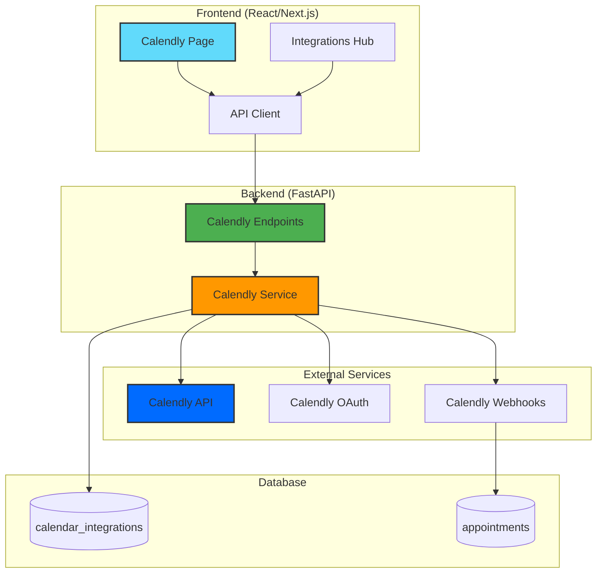
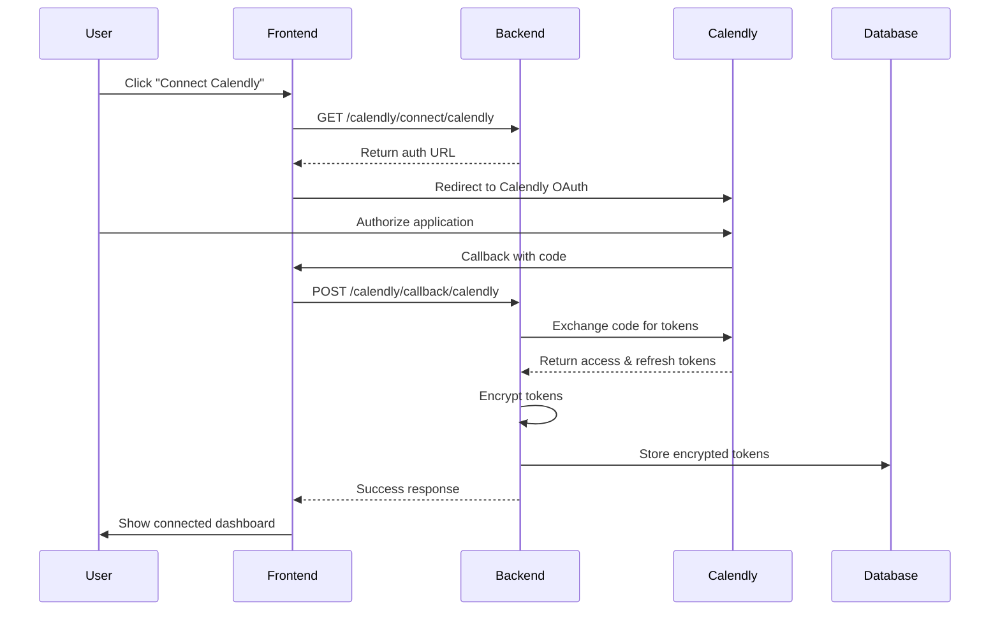
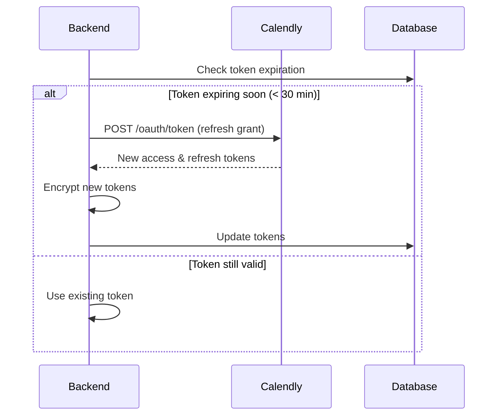
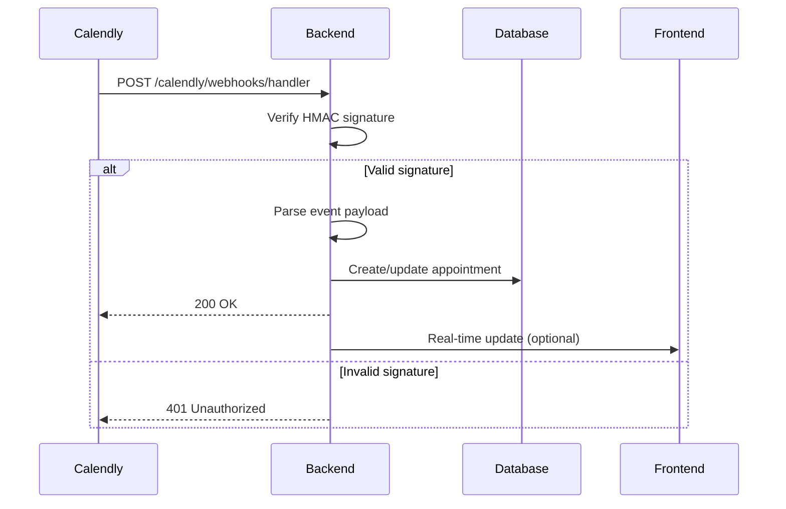
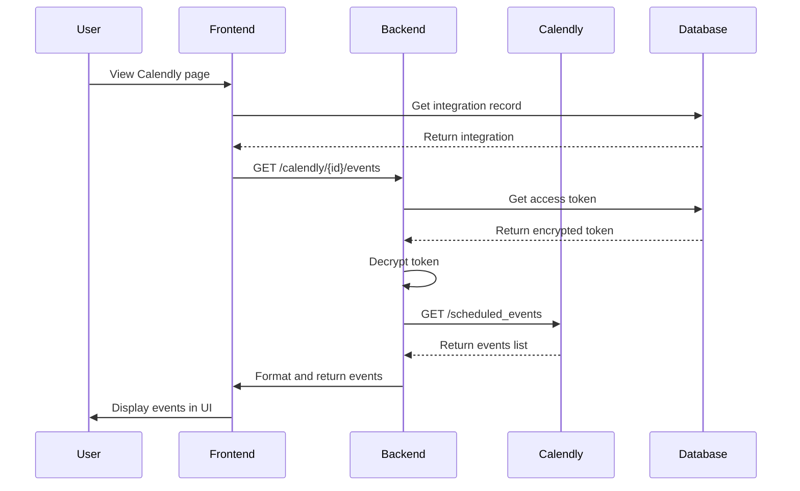
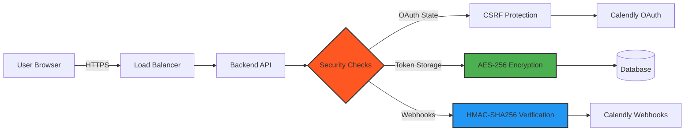
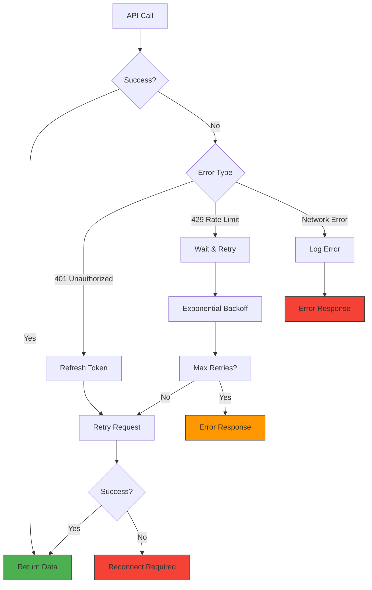
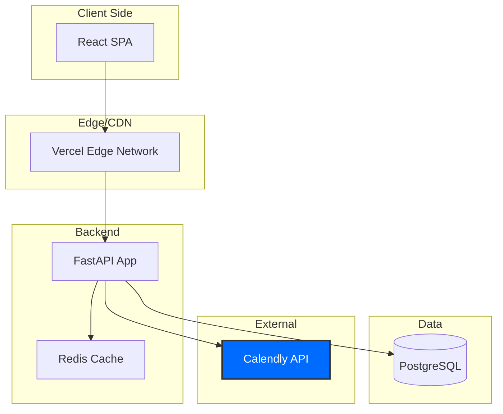
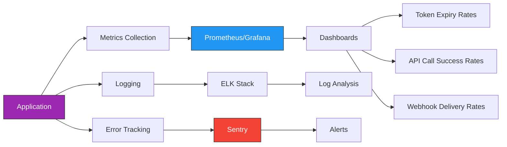

# Calendly Integration Architecture

## System Architecture Diagram



## Component Flow

### 1. OAuth Connection Flow



### 2. Token Refresh Flow



### 3. Webhook Event Flow



### 4. Event Retrieval Flow



## Data Models

### CalendarIntegration Table

```
┌─────────────────────────┐
│ calendar_integrations   │
├─────────────────────────┤
│ id (PK)                 │
│ business_id (FK)        │
│ provider = 'calendly'   │
│ access_token (encrypted)│
│ refresh_token (encrypted)│
│ token_expires_at        │
│ calendar_id (URI)       │
│ status                  │
│ last_sync_at            │
│ created_at              │
│ updated_at              │
└─────────────────────────┘
```

### Appointment Table (created from webhooks)

```
┌─────────────────────────┐
│ appointments            │
├─────────────────────────┤
│ id (PK)                 │
│ business_id (FK)        │
│ customer_id (FK)        │
│ customer_name           │
│ customer_phone          │
│ customer_email          │
│ appointment_time        │
│ service_type            │
│ status                  │
│ source = 'calendly'     │
│ created_at              │
│ updated_at              │
└─────────────────────────┘
```

## Security Architecture



## API Request Flow

### Authenticated Request

```
Client Request
    ↓
[Authorization Header: Bearer {token}]
    ↓
[JWT Validation Middleware]
    ↓
[Business ID Extraction]
    ↓
[Calendly Endpoint Handler]
    ↓
[Service Layer]
    ↓
[Calendly API Call]
    ↓
[Response Formatting]
    ↓
Client Response
```

## Error Handling Strategy



## Deployment Architecture



## Technology Stack

```
Frontend
├── React 18
├── Next.js 14
├── TypeScript 5
├── Material-UI
└── Axios

Backend
├── Python 3.11
├── FastAPI
├── SQLAlchemy
├── aiohttp (async HTTP)
├── Cryptography (encryption)
└── Pydantic

External
├── Calendly API v2
├── Calendly OAuth 2.0
└── Calendly Webhooks

Database
└── PostgreSQL with pgvector
```

## Scalability Considerations

### Rate Limiting
- Calendly: 100 requests/minute per app
- Solution: Implement request queuing and caching

### Token Management
- Auto-refresh before expiry (30 min buffer)
- Queue pending requests during refresh

### Webhook Scaling
- Use message queue for high volume
- Async processing with background tasks
- Idempotent webhook handlers

### Database Optimization
```sql
-- Indexes for performance
CREATE INDEX idx_calendar_integrations_business 
ON calendar_integrations(business_id, provider);

CREATE INDEX idx_appointments_source 
ON appointments(source, business_id);
```

## Monitoring & Observability



## Key Metrics to Track

1. **OAuth Metrics**
   - Connection success rate
   - Token refresh success rate
   - Average token lifetime

2. **API Metrics**
   - Requests per minute
   - Average response time
   - Error rate by endpoint

3. **Webhook Metrics**
   - Events received per hour
   - Processing success rate
   - Signature verification failures

4. **Business Metrics**
   - Active Calendly integrations
   - Bookings synced per day
   - Cancellation rate

---

This architecture ensures:
- ✅ **Security**: Multiple layers of protection
- ✅ **Scalability**: Handles growth gracefully
- ✅ **Reliability**: Robust error handling
- ✅ **Observability**: Comprehensive monitoring
- ✅ **Maintainability**: Clean separation of concerns
